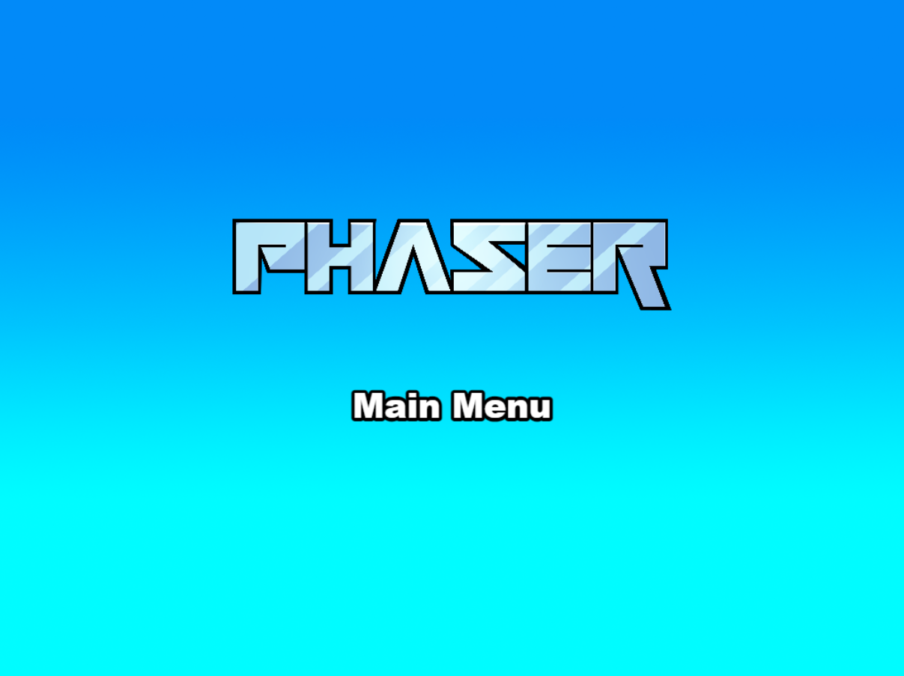

# Phaser RPG 遊戲專案

這是一個使用 Phaser 3 開發的 RPG 遊戲專案。遊戲採用 TypeScript 開發，使用 Vite 作為建構工具。

## 遊戲特色

- 👾 完整的 RPG 遊戲系統
- ⚔️ 豐富的技能系統
- 🎮 直觀的裝備系統
- 📦 物品欄管理
- 🎯 即時戰鬥系統
- 🗺️ 多張地圖場景

### Versions

This template has been updated for:

- [Phaser 3.88.2](https://github.com/phaserjs/phaser)
- [Vite 6.3.1](https://github.com/vitejs/vite)
- [TypeScript 5.7.2](https://github.com/microsoft/TypeScript)



## Requirements

[Node.js](https://nodejs.org) is required to install dependencies and run scripts via `npm`.

## Available Commands

| Command | Description |
|---------|-------------|
| `npm install` | Install project dependencies |
# 快速開始

1. 安裝依賴：
```bash
npm install
```

2. 開發模式：
```bash
npm run dev
```

3. 建構專案：
```bash
npm run build
```

## 開發特點

- 🔥 使用 TypeScript 確保程式碼品質
- 🛠️ Vite 提供快速的開發體驗
- 📦 模組化的程式碼結構
- 🎮 完整的遊戲框架
- 🔧 開發者除錯工具

## 專案結構

```
src/
├── core/          # 核心遊戲邏輯
├── game/          # 遊戲場景與物件
├── ui/            # 使用者介面元件
└── debug/         # 除錯工具
```

## 系統需求

- Node.js 18.0.0 或更高版本
- 現代瀏覽器（支援 WebGL）

## 授權

本專案採用 MIT 授權條款

After cloning the repo, run `npm install` from your project directory. Then, you can start the local development server by running `npm run dev`.

The local development server runs on `http://localhost:8080` by default. Please see the Vite documentation if you wish to change this, or add SSL support.

Once the server is running you can edit any of the files in the `src` folder. Vite will automatically recompile your code and then reload the browser.

## Template Project Structure

We have provided a default project structure to get you started. This is as follows:

## Template Project Structure

We have provided a default project structure to get you started:

| Path                         | Description                                                |
|------------------------------|------------------------------------------------------------|
| `index.html`                 | A basic HTML page to contain the game.                     |
| `public/assets`              | Game sprites, audio, etc. Served directly at runtime.      |
| `public/style.css`           | Global layout styles.                                      |
| `src/main.ts`                | Application bootstrap.                                     |
| `src/game`                   | Folder containing the game code.                           |
| `src/game/main.ts`           | Game entry point: configures and starts the game.          |
| `src/game/scenes`            | Folder with all Phaser game scenes.                        | 


## Handling Assets

Vite supports loading assets via JavaScript module `import` statements.

This template provides support for both embedding assets and also loading them from a static folder. To embed an asset, you can import it at the top of the JavaScript file you are using it in:

```js
import logoImg from './assets/logo.png'
```

To load static files such as audio files, videos, etc place them into the `public/assets` folder. Then you can use this path in the Loader calls within Phaser:

```js
preload ()
{
    //  This is an example of an imported bundled image.
    //  Remember to import it at the top of this file
    this.load.image('logo', logoImg);

    //  This is an example of loading a static image
    //  from the public/assets folder:
    this.load.image('background', 'assets/bg.png');
}
```

When you issue the `npm run build` command, all static assets are automatically copied to the `dist/assets` folder.

## Deploying to Production

After you run the `npm run build` command, your code will be built into a single bundle and saved to the `dist` folder, along with any other assets your project imported, or stored in the public assets folder.

In order to deploy your game, you will need to upload *all* of the contents of the `dist` folder to a public facing web server.

## Customizing the Template

### Vite

If you want to customize your build, such as adding plugin (i.e. for loading CSS or fonts), you can modify the `vite/config.*.mjs` file for cross-project changes, or you can modify and/or create new configuration files and target them in specific npm tasks inside of `package.json`. Please see the [Vite documentation](https://vitejs.dev/) for more information.

## About log.js

If you inspect our node scripts you will see there is a file called `log.js`. This file makes a single silent API call to a domain called `gryzor.co`. This domain is owned by Phaser Studio Inc. The domain name is a homage to one of our favorite retro games.

We send the following 3 pieces of data to this API: The name of the template being used (vue, react, etc). If the build was 'dev' or 'prod' and finally the version of Phaser being used.

At no point is any personal data collected or sent. We don't know about your project files, device, browser or anything else. Feel free to inspect the `log.js` file to confirm this.

Why do we do this? Because being open source means we have no visible metrics about which of our templates are being used. We work hard to maintain a large and diverse set of templates for Phaser developers and this is our small anonymous way to determine if that work is actually paying off, or not. In short, it helps us ensure we're building the tools for you.

However, if you don't want to send any data, you can use these commands instead:

Dev:

```bash
npm run dev-nolog
```

Build:

```bash
npm run build-nolog
```

Or, to disable the log entirely, simply delete the file `log.js` and remove the call to it in the `scripts` section of `package.json`:

Before:

```json
"scripts": {
    "dev": "node log.js dev & dev-template-script",
    "build": "node log.js build & build-template-script"
},
```

After:

```json
"scripts": {
    "dev": "dev-template-script",
    "build": "build-template-script"
},
```

Either of these will stop `log.js` from running. If you do decide to do this, please could you at least join our Discord and tell us which template you're using! Or send us a quick email. Either will be super-helpful, thank you.

## Join the Phaser Community!

We love to see what developers like you create with Phaser! It really motivates us to keep improving. So please join our community and show-off your work 😄

**Visit:** The [Phaser website](https://phaser.io) and follow on [Phaser Twitter](https://twitter.com/phaser_)<br />
**Play:** Some of the amazing games [#madewithphaser](https://twitter.com/search?q=%23madewithphaser&src=typed_query&f=live)<br />
**Learn:** [API Docs](https://newdocs.phaser.io), [Support Forum](https://phaser.discourse.group/) and [StackOverflow](https://stackoverflow.com/questions/tagged/phaser-framework)<br />
**Discord:** Join us on [Discord](https://discord.gg/phaser)<br />
**Code:** 2000+ [Examples](https://labs.phaser.io)<br />
**Read:** The [Phaser World](https://phaser.io/community/newsletter) Newsletter<br />

Created by [Phaser Studio](mailto:support@phaser.io). Powered by coffee, anime, pixels and love.

The Phaser logo and characters are &copy; 2011 - 2025 Phaser Studio Inc.

All rights reserved.
